# lab1实验报告


## 实验设计过程


### L版本设计过程

L版本的要求为代码行数尽可能的少，对于乘法的实现，若要求行数尽量少，其实是用最为简单的算法即可，即将乘法转换为加法来实现。
$$
3\times9 = 9+9+9
$$
即我们可以通过一个寄存器一直循环累加，另一个寄存器用来控制循环次数，以此达到乘法的目的。对于LC3的负数来说，由于其不断减一也可循环至0，故正数与负数的情况都适用。
易知LC3中进行惩罚运算与我们在c语言中对short型数进行乘法运算一致，故此实验思路的算法如下c程序所示：
``` c
#include <stdio.h>
int main()
{
    short r1,r2;
    short r7 = 0;
    scanf("%hd%hd",&r1,&r2);
    short j;
    j = r1*r2;
    printf("正确答案为:%hd\n",j);
    while(r2)
    {
        r7 = r1+r7;
        r2--;
    }
    printf("答案为%hd",r7);
}
```
对于其正确性，我们通过实验要求中的测试样例来证明
<center class = "half">
    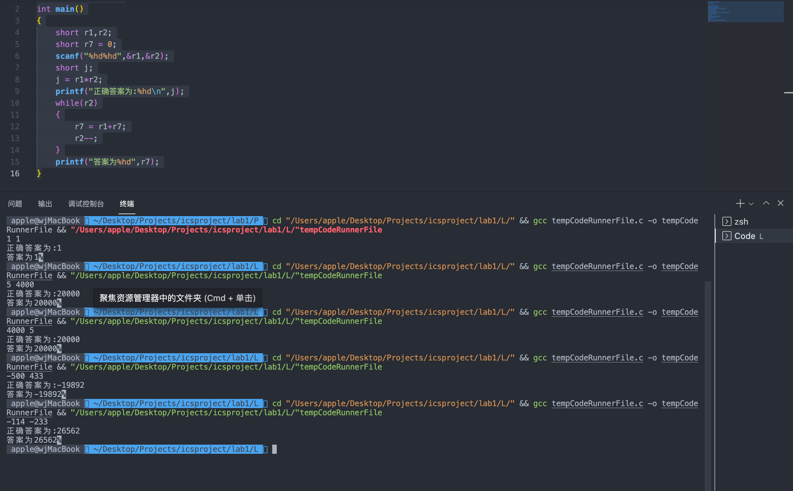
</center>
故我们验证了此算法的正确性。
由此编写核心机器代码如下所示

``` 

0001 111 111 0 00 000   ;r7 <= r7+r0   x3007
0001 001 001 1 11111    ;r1 <= r1-1     
0000 101 111111101      ;jump to x3007 

```
该代码为核心部分，<font color = red>省略了赋予寄存器初值与判断乘数是否为0的部分(由于判断是否为0的代码与赋予初值的代码同时出现，此处不再加上)。</font>
为了检测代码在LC3中是否正确，下面为完整的测试代码：

```
; start the program at location x3000 
0011 0000 0000 0000
;my own program
0101 000 000 1 00000    ;r0 <= 0    x3000
0101 001 001 1 00000    ;r1 <= 0    x3001
0101 111 111 1 00000    ;r7 <= 0   x3002
0001 000 000 1 00001    ;r0 <= 1    x3003
0001 001 001 1 00001    ;r1 <= 1    x3004
0000 010 000000100      ;若r1为0 则跳转终止
0101 111 111 1 00000    ;r7 <= 0   
0001 111 111 0 00 000   ;r7 <= r7+r0   x3007
0001 001 001 1 11111    ;r1 <= r1-1     
0000 101 111111101      ;junmp to x3007        
1111 0000 00100101      ;halt       

```
以上为将其赋予初值为1和1，在实际测试中，我们通过直接在LC3的Register窗口对R0与R1进行初值的赋予，测试结果如下：
<center class = "half">
    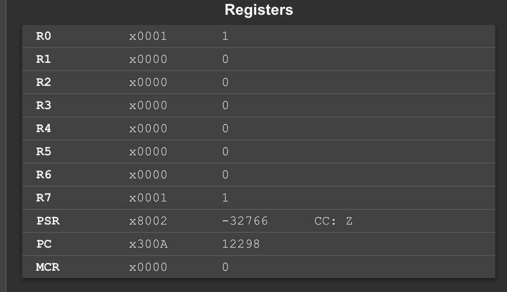
    
    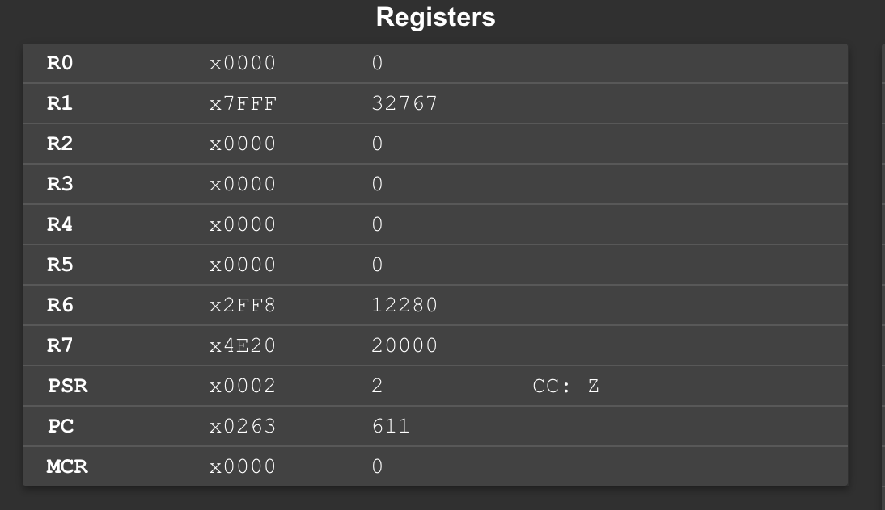
    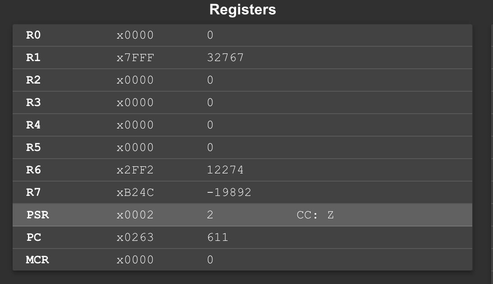
    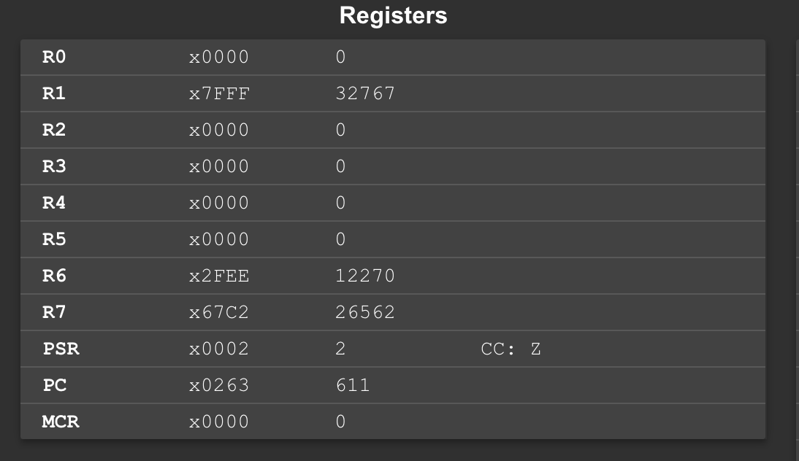
</center>


由此和我们在c程序中得到的答案一致，至此验证了L版本的正确性。
### P版本的设计过程
对于乘法来说，我们如果通过手工计算，一般是用竖式计算得到结果。在竖式计算中，每次用1或0乘以对应的数，并且每次左移一位最后累加得到结果。故为了减少指令条数，我们可以通过计算机来模拟这个过程（类似于分解）
即：

$$
a \times b = a \times (b1+b2+b3+····)
$$
由此，我们可以得到对应的c语言代码如下所示：

```c
#include <stdio.h>
int main()
{
    short ans,a,b;
    ans = 0;
    scanf("%hd%hd",&a,&b);
    while(b)
    {
        if(b&1) 
        {
            ans = ans+a;
        }
        b>>1;
        a = a+a;
    }
    printf("%hd",ans);
}
```
由输出结果可验证其正确性，但是随之而来一个明显的问题，LC3中如果要完成右移操作十分困难，结果思考之后，我们避免了右移操作，得到了如下代码：

```c
#include <stdio.h>
int main()
{
    short ans,a,b;
    short cnt = 1;
    ans = 0;
    scanf("%hd%hd",&a,&b);
    while(cnt)
    {
        if(b&cnt) 
        {
            ans = ans+a;
        }
        cnt = cnt<<1;
        a = a+a;
    }
    printf("%hd",ans);
}
```
在这里我们运用了一个cnt，将右移操作等效转换为左移操作。
代码正确性验证结果如下图所示：
<center class = "half">
    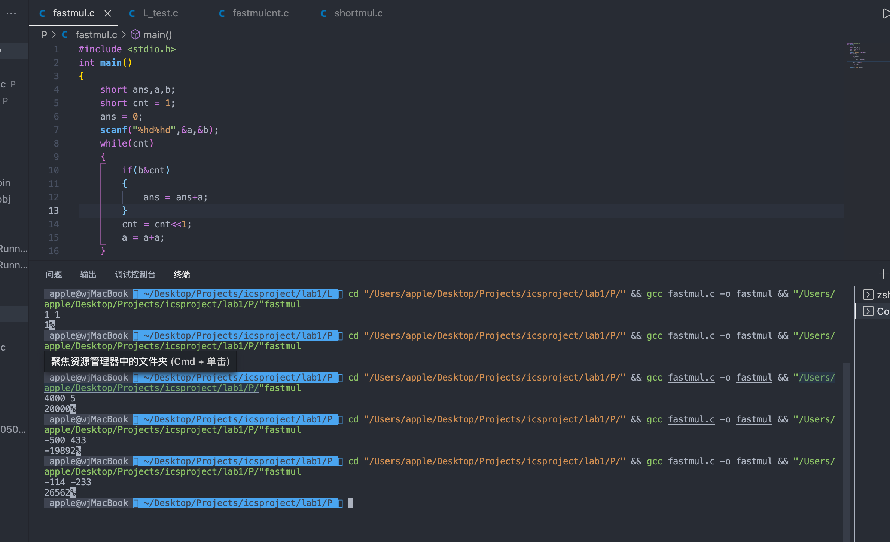
</center>
由结果的正确性，我们可以得到核心机器码如下所示：

```
0101 011 001 0 00 100   ;r1第cnt位是否为1,为1就把1放到r3,否则放0到r3
0000 010 000000001      ;若r1的第cnt为0,则跳转
0001 111 111 0 00 000   ;r7 <= r7+r0
0001 000 000 0 00 000   ;r0 <= r0+r0
0001 100 100 0 00 100   ;cnt <= cnt+cnt
0000 101 111111010      ;若cnt不为0,则继续循环 -6
```
其中的cnt即为r4寄存器。<font color = red>上述核心机器码省略了清0与赋予初值等部分。</font>
为了验证结果的正确性，下面为完整的机器码：
```
; start the program at location x3000 
0011 0000 0000 0000
;my own project
0101 111 111 1 00000   ;r7 <= 0   x3000
0101 001 001 1 00000   ;r1 <= 0   x3001
0101 010 010 1 00000   ;r2 <= 0   x3002
0101 000 000 1 00000   ;r0 <= 0   x3003
0101 100 100 1 00000   ;r4 <= 0   r4即为cnt
0001 000 000 1 00001   ;r0 <= 1           
0001 001 001 1 00001   ;r1 <= 1   
0001 100 100 1 00001   ;r4 <= 1
0101 011 001 0 00 100  ;r1第cnt位是否为1,为1就把1放到r3,否则放0到r3
0000 010 000000001     ;若r1的第cnt为0,则跳转
0001 111 111 0 00 000  ;r7 <= r7+r0
0001 000 000 0 00 000  ;r0 <= r0+r0
0001 100 100 0 00 100  ;cnt <= cnt+cnt
0000 101 111111010     ;若cnt不为0,则继续循环 -6
;终止
1111 0000 00100101  
```
寄存器的不同初值通过LC3的寄存器窗口进行操作，下面为运行结果：
<center class = "half">
    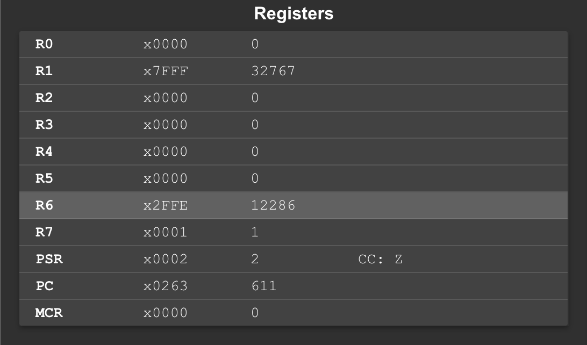
    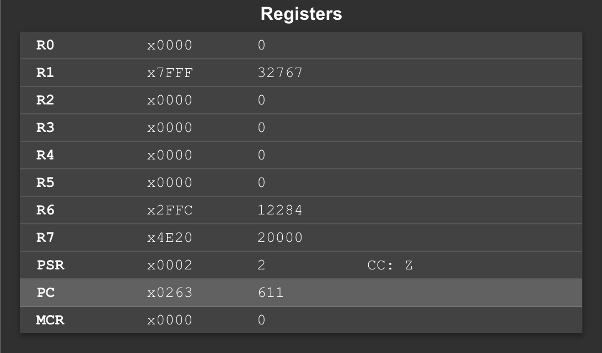
    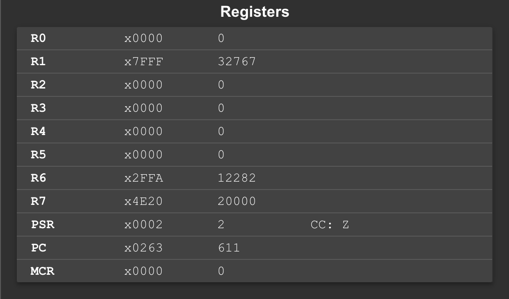
    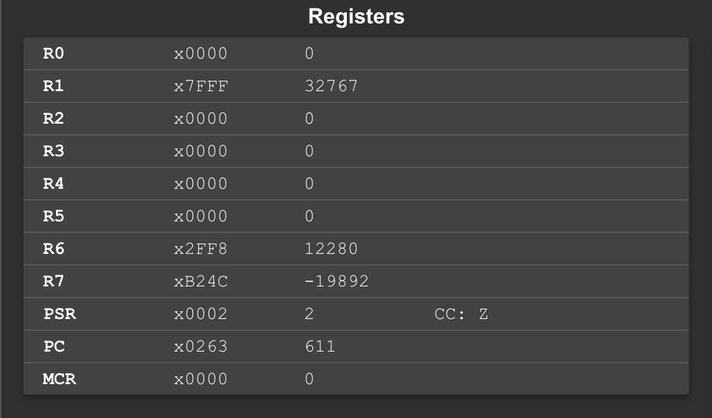
    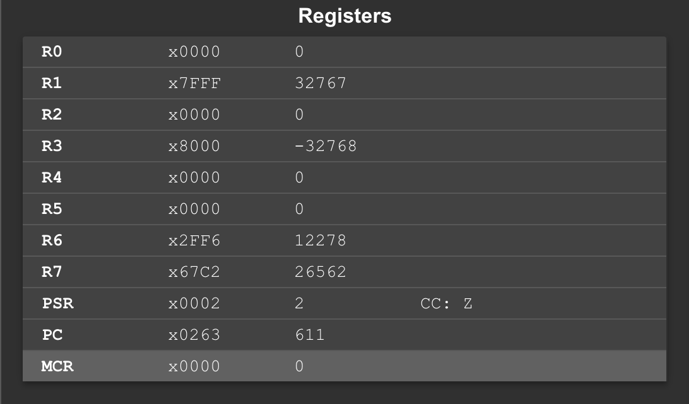
</center>

由上述结果可验证P版本程序的正确性。
对于测试该P版本的指令数，我们可以通过如下c语言代码来计算指令数：
```c
#include <stdio.h>
int main()
{
    short ans,a,b;
    short cnt = 1;
    int counter;
    ans = 0;
    scanf("%hd%hd",&a,&b);
    short c = a*b;
    printf("标准答案为%hd\n",c);
    counter = 8;
    while(cnt)
    {
        counter++;
        if(b&cnt) 
        {
            counter++;
            ans = ans+a;
            counter++;
        }else counter++;
        cnt = cnt<<1;
        counter++;
        a = a+a;
        counter++;
        counter++;
    }
    counter++;
    printf("答案为%hd\n",ans);
    printf("指令数为%d\n",counter);
}
```
计算指令数结果如下图所示：
<center class = "half">
    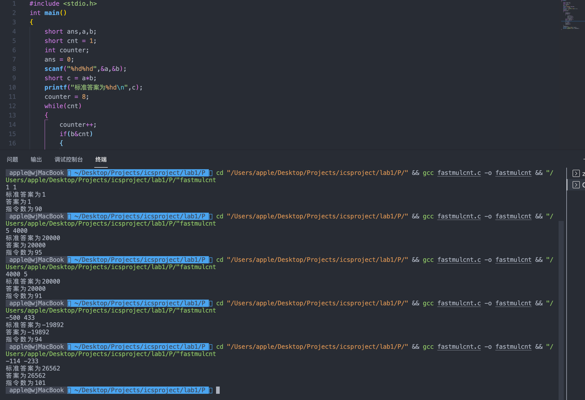
</center>

**由上述计算结果可知测试样例所需的平均指令数为94条。**    满足实验要求。
## L版本的优化过程
由于L版本算法简单，容易想到且只用了3行核心机器码，故L版本的最初版本与最终版本一致。
## P版本的优化过程
对于P版本的代码，我一开始是从L版本的代码出发，
利用下面的代码：
``` c
#include <stdio.h>
int main()
{
    short r1,r2;
    short r7 = 0;
    scanf("%hd%hd",&r1,&r2);
    short j;
    j = r1*r2;
    int counter = 5;
    if(r2 == 0) counter++;
    counter++;
    printf("正确答案为:%hd\n",j);
    while(r2)
    {
        r7 = r1+r7;
        counter++;
        r2--;
        counter++;
        counter++;
    }
    counter++;
    printf("答案为%hd\n",r7);
    printf("指令数为:%d\n",counter);
}
```
计算出指令数如下图所示：
<center class = "half">
    
</center>

**平均指令数为41852。**
对于该版本，我又试了一些优化的方式，例如将r0与r1寄存器中的值进行比较，将小的那一个作为控制循环次数的变量，这种方法确实优化了一些，但是还未满足实验的要求。
接着我又尝试了另外一种优化的方法，在上面的基础上，我发现负数造成了指令数过大，而在乘法过程中，负数之间的乘法同时也可以由正数来代替，故我利用了一个寄存器来记录两数相乘的符号，然后将乘法转换为两个正数相乘。这种方法在测试样例中表现一般，仍然超出了指定的指令数。**平均为348条指令数**，而最后联系之前学过的算法相关知识，可使用快速乘法的技巧，优化得到平均指令数为**94条**。


​    