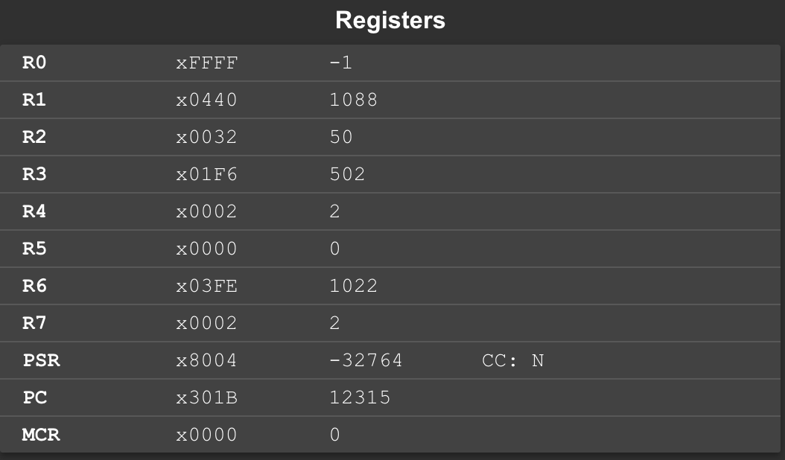

# Lab2实验报告
## 实验设计过程与思路
本实验主要任务为利用LC3的汇编程序，完成计算一个类似于斐波那契数列的值的功能。首先，思路与利用c语言求解改问题类似，如果我们在高级语言中，这种问题往往会利用递归来求解，递归写出来的代码通常简明易懂。但是随之而来的又有许多问题：第一个是**递归的效率往往较低**，第二个是**利用汇编语言不太容易实现递归操作**。在第一个问题中我们首先撰写了c语言的递归代码如下所示：
```c
#include <stdio.h>
int F(int n)
{
    if(n == 0) return 1;
    if(n == 1) return 1;
    if(n == 2) return 2;
    return ((F(n-1)+2*F(n-3))%1024);
}
int main()
{
    int n;
    scanf("%d",&n)
    printf("%d",F(n));
    return 0;
}
```
该代码在计算较大的数值时，需要很长时间才能求得结果，我们对其进行改进，得到如下代码：
```c
#include <stdio.h>
int F(int n)
{
    if((n--) == 0) return 1;
    else if((n--) == 0) return 1;
    else if((n--) == 0) return 2;
    else 
    {
        int a = 1;
        int b = 1;
        int c = 2;
        int d;
        while(n >= 0)
        {
            d = (c+2*a)%1024;
            a = b;
            b = c;
            c = d;
            n--;
        }
        return d;
    }
}
int main()
{
    int n;
    scanf("%d",&n);
    printf("%d",F(n));
    return 0;
}
```
这里我们采用了非递归的方法。
由此，即可根据c语言的代码进行汇编程序的撰写，得到的优化后的最终L版本如下所示：
```asm
.ORIG	x3000
LD      R6,mod
ADD     R4,R4,#2   
ADD     R7,R7,#1    ;R5存放结果        
AND     R1,R0,#-1   ;判断n是否为0
BRz     lb3
ADD     R0,R0,#-1   ;判断n是否为1
BRz     lb3
ADD     R7,R7,R7    ;将R5置为2
ADD     R0,R0,#-2   ;判断n是否为2
BRn     lb3
ADD     R2,R2,#1    ;R2 = a,R3 = b;R4 = c;R5 = d
ADD     R3,R3,#1
lb1 ADD     R2,R2,R2    ;2*a
ADD     R5,R4,R2    ;c+2*a
AND     R7,R7,R6
lb0 ADD     R2,R3,#0
ADD     R3,R4,#0
ADD     R4,R7,#0
ADD     R0,R0,#-1
BRzp    lb1
lb3     HALT   
mod    .FILL	x03FE
pba    .FILL	#930
pbb    .FILL	#10
pbc    .FILL	#86
pbd    .FILL	#854
.END
```
最终得到的代码去掉ORIG和END后行数为**26行**。
接下来我们来验证程序的正确性，采用的样例位Lab3中的n = 24, 144, 456, 1088, 1092, 2096, 4200, 8192, 12000, 14000。
测试采用的汇编代码为上面的代码再加上初始置0与R0的赋值，再此不再附上，下为测试结果：
<center class = "half">
    
    
    
    
    
    
    
    
    
    
</center>
再对比c语言程序的运行结果如下图所示：
<center class = "half">
    
</center>
由上述结果可验证代码的正确性。

## L版本的优化过程
L版本在最初经历了不少修改，对应的c语言描述也进行了数次修改，最终第五版才确定了最终代码：
<center class = "half">
    
</center>

一开始采用调用函数的写法，代码如下所示：

```asm
.ORIG	x3000
LD      R6,mins
JSR     Fn
ADD     R7,R5,#0
Fn      ADD     R4,R4,#1
        AND     R1,R0,#-1
        LD      R5,n0
        BRz     lb3
        ADD     R1,R0,#-1
        BRz     lb3
        ADD     R4,R4,#1
        ADD     R1,R0,#-2
        ADD     R5,R5,R5
        BRz     lb3
        LD      R2,n0       ;R2 = a,R3 = b;R4 = c;R5 = d
        LD      R3,n0
    lb1 ADD     R2,R2,R2    ;2*a
        ADD     R5,R4,R2    ;c+2*a
        ADD     R1,R5,R6    
        BRn     lb0
        ADD     R5,R1,#0
    lb0 ADD     R2,R3,#0
        ADD     R3,R4,#0
        ADD     R4,R5,#0
        ADD     R0,R0,#-1
        ADD     R1,R0,#-3
        BRzp    lb1   
    lb3 RET   
n0      .FILL	x0001
n2      .FILL	x0010
mins    .FILL	xF800
pba     .FILL	#20
pbb     .FILL	#5
pbc     .FILL	#9
pbd     .FILL	#99
.END
```
代码总共需要36行。这是最初的一个版本。之后我发现，这个版本中对寄存器的一些调用语句可以优化，由此得到了第二个版本代码如下所示：
```asm
.ORIG	x3000
LD      R6,mins
JSR     Fn
ADD     R7,R5,#0
Fn      ADD     R4,R4,#2   
        ADD     R5,R5,#1    ;R5存放结果        
        AND     R1,R0,#-1   ;判断n是否为0
        BRz     lb3
        ADD     R0,R0,#-1   ;判断n是否为1
        BRz     lb3
        ADD     R5,R5,R5    ;将R5置为2
        ADD     R0,R0,#-1   ;判断n是否为2
        BRz     lb3
        ADD     R0,R0,#-1
        ADD     R2,R2,#1    ;R2 = a,R3 = b;R4 = c;R5 = d
        ADD     R3,R3,#1
    lb1 ADD     R2,R2,R2    ;2*a
        ADD     R5,R4,R2    ;c+2*a
        ADD     R1,R5,R6    
        BRn     lb0
        ADD     R5,R1,#0
    lb0 ADD     R2,R3,#0
        ADD     R3,R4,#0
        ADD     R4,R5,#0
        ADD     R0,R0,#-1
        BRzp    lb1   
    lb3 RET   
mins    .FILL	#-1024
pba     .FILL	#20
pbb     .FILL	#5
pbc     .FILL	#9
pbd     .FILL	#99
.END
```
代码总长度为33行。虽然达到了实验要求，但是对该代码我继续进行了优化。在此我发现，该版本的取模运算时采用的是减法的策略，但是我们对1024这个数可以采用位运算的方式，如下：
$$
a\ mode\ b = a \& (b-1) \ \ \ b\in\ 2^n
$$
由上述公式，我们可以采用为运算的方式对代码进行优化，得到结果如下所示：
```asm
.ORIG	x3000
LD      R6,mod
JSR     Fn
ADD     R7,R5,#0
Fn      ADD     R4,R4,#2   
        ADD     R5,R5,#1    ;R5存放结果        
        AND     R1,R0,#-1   ;判断n是否为0
        BRz     lb3
        ADD     R0,R0,#-1   ;判断n是否为1
        BRz     lb3
        ADD     R5,R5,R5    ;将R5置为2
        ADD     R0,R0,#-1   ;判断n是否为2
        BRz     lb3
        ADD     R0,R0,#-1
        ADD     R2,R2,#1    ;R2 = a,R3 = b;R4 = c;R5 = d
        ADD     R3,R3,#1
    lb1 ADD     R2,R2,R2    ;2*a
        ADD     R5,R4,R2    ;c+2*a
        AND     R5,R5,R6
    lb0 ADD     R2,R3,#0
        ADD     R3,R4,#0
        ADD     R4,R5,#0
        ADD     R0,R0,#-1
        BRzp    lb1   
    lb3 RET   
mod    .FILL	x03FE
pba    .FILL	#930
pbb    .FILL	#10
pbc    .FILL	#86
pbd    .FILL	#854
.END
```
得到代码总长度为31行，再由上面判断特殊情况的代码再进行简化，得到第四个版本的代码如下所示：
```asm
.ORIG	x3000
LD      R6,mod
JSR     Fn
ADD     R7,R5,#0
Fn      ADD     R4,R4,#2   
        ADD     R5,R5,#1    ;R5存放结果        
        AND     R1,R0,#-1   ;判断n是否为0
        BRz     lb3
        ADD     R0,R0,#-1   ;判断n是否为1
        BRz     lb3
        ADD     R5,R5,R5    ;将R5置为2
        ADD     R0,R0,#-2   ;判断n是否为2
        BRn     lb3
        ADD     R2,R2,#1    ;R2 = a,R3 = b;R4 = c;R5 = d
        ADD     R3,R3,#1
    lb1 ADD     R2,R2,R2    ;2*a
        ADD     R5,R4,R2    ;c+2*a
        AND     R5,R5,R6
    lb0 ADD     R2,R3,#0
        ADD     R3,R4,#0
        ADD     R4,R5,#0
        ADD     R0,R0,#-1
        BRzp    lb1   
    lb3 RET   
mod    .FILL	x03FE
pba    .FILL	#930
pbb    .FILL	#10
pbc    .FILL	#86
pbd    .FILL	#854
.END
```
得到的代码长度为30行。最后，我发现，这这个较为简单的问题中，将代码实现写成函数调用的形式多此一举，故在最终版本中，我将调用函数直接写成了循环，再次减少了代码行数，代码如下所示：
```asm
.ORIG	x3000
LD      R6,mod
ADD     R4,R4,#2   
ADD     R7,R7,#1    ;R7存放结果        
AND     R1,R0,#-1   ;判断n是否为0
BRz     lb3
ADD     R0,R0,#-1   ;判断n是否为1
BRz     lb3
ADD     R7,R7,R7    ;将R7置为2
ADD     R0,R0,#-2   ;判断n是否为2
BRn     lb3
ADD     R2,R2,#1    ;R2 = a,R3 = b;R4 = c;R5 = d
ADD     R3,R3,#1
lb1 ADD     R2,R2,R2    ;2*a
ADD     R7,R4,R2    ;c+2*a
AND     R7,R7,R6
lb0 ADD     R2,R3,#0
ADD     R3,R4,#0
ADD     R4,R7,#0
ADD     R0,R0,#-1
BRzp    lb1
lb3     HALT
mod    .FILL	x03FE
pba    .FILL	#930
pbb    .FILL	#10
pbc    .FILL	#86
pbd    .FILL	#854
.END
```
故综上，得到最终的代码行数为**26行**。