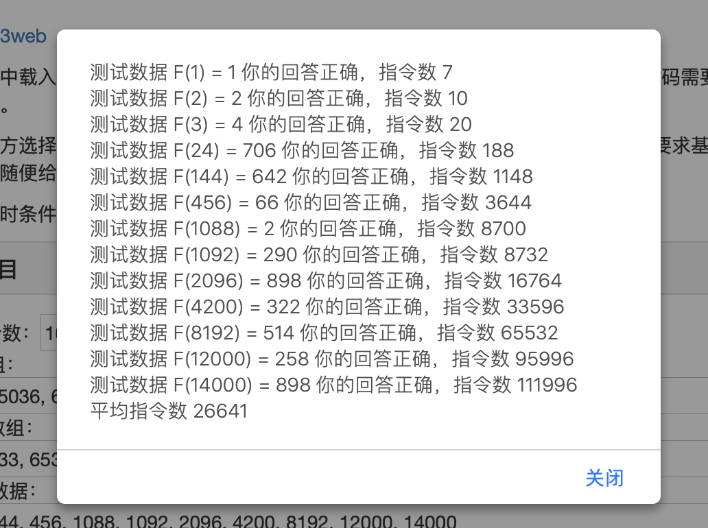
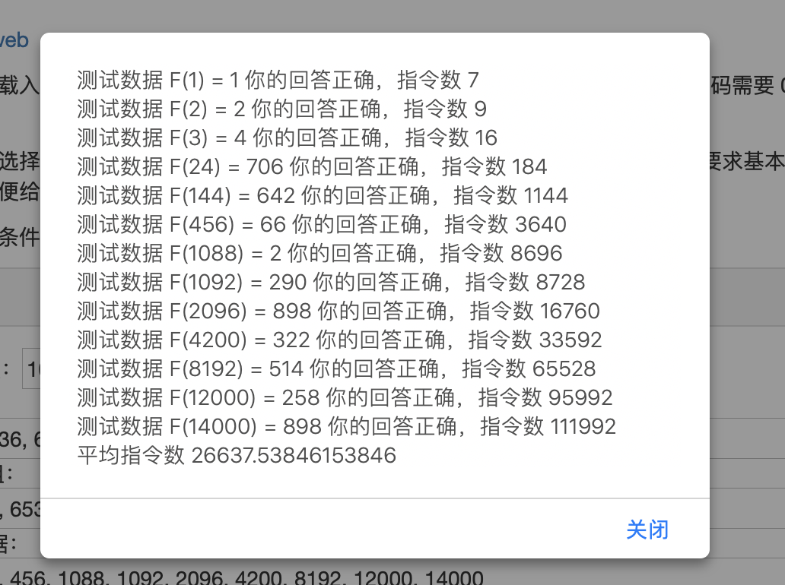
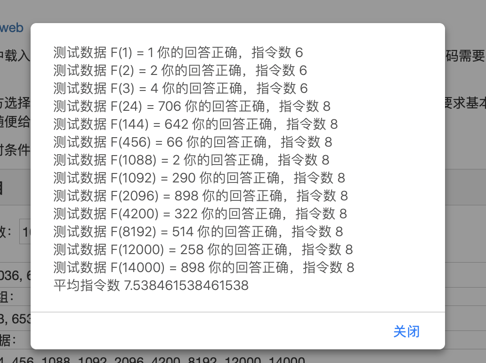

# lab3实验报告
## task
### task 1: read and understand
在任务一中，我们需要读懂助教分发的别人的程序，由于我们班存在未写实验
情况，故未收到其他人的lab2的fib.txt文件。在这里按照助教的要求分析和优化自己的lab2程序。
下面是本人的lab2程序：
``` asm
.ORIG	x3000
LD      R6,mod
ADD     R4,R4,#2   
ADD     R7,R7,#1           
AND     R1,R0,#-1   
BRz     lb3
ADD     R0,R0,#-1   
BRz     lb3
ADD     R7,R7,R7    
ADD     R0,R0,#-2   
BRn     lb3
ADD     R2,R2,#1    
ADD     R3,R3,#1
lb1 ADD     R2,R2,R2    
ADD     R7,R4,R2    
AND     R7,R7,R6
lb0 ADD     R2,R3,#0
ADD     R3,R4,#0
ADD     R4,R7,#0
ADD     R0,R0,#-1
BRzp    lb1
lb3     HALT
mod    .FILL	x03FF
F(a)    .FILL	#930
F(b)    .FILL	#10
F(c)    .FILL	#86
F(d)    .FILL	#854
.END
```
本人程序的思路为将一个递归程序转化为一个非递归的程序，用c语言描述思路即如下所示：
``` c
#include <stdio.h>
int F(int n)
{
    if((n--) == 0) return 1;
    else if((n--) == 0) return 1;
    else if((n--) == 0) return 2;
    else 
    {
        int a = 1;
        int b = 1;
        int c = 2;
        int d;
        while(n >= 0)
        {
            d = (c+2*a)%1024;
            a = b;
            b = c;
            c = d;
            n--;
        }
        return d;
    }
}
int main()
{
    int n;
    scanf("%d",&n);
    printf("%d",F(n));
    return 0;
}
```
其中一些细节处理不再赘述。主要思路可以简化为用四个寄存器存放并更新每次循环的结果。
### task 2: guess
由于本次没有拿到别人的实验，所以分析自己的实验，故猜学号这一任务就在文件中填写了自己的学号。
### task 3: optimize
对于原程序，我们利用lc3的测评工具，测试实验文档中给的数据得到该程序的平均指令数为**26641**条。测试结果如图所示：
<center class = "half">
    
</center>
下面我们对其进行优化。
首先由于原程序中存在对R0 == 0的判断，我们先将其省略，并略微修改之后的代码，得到代码如下所示：

``` asm
    .ORIG	x3000
    ADD	R1,	R1,	#1 
    ADD	R2,	R2,	#1 
    ADD	R3,	R3,	#2 
    LD	R4,	mod
    ADD	R0,	R0,	#-1 
    BRp	f1 
    ADD	R7,	R2, #0 
    HALT
f1  ADD	R0,	R0,	#-1 
    BRp	f2 
    ADD	R7,	R3, #0 
    HALT
f2  ADD	R5,	R1,	R1 
    ADD	R7,	R5,	R3
    AND	R7,	R7,	R4
    ADD	R1,	R2,	#0
    ADD	R2,	R3,	#0
    ADD	R3,	R7,	#0
    ADD	R0,	R0,	#-1
    BRp	f2
    HALT
    mod    .FILL	x03FF 
    .END
```
对于该代码而言，除了优化了对0的判断，还优化了对于寄存器的操作，但是由于思路没变，其优化效果甚微，平均指令数如下所示：
<center class = "half">
    
</center>

优化到原来的**99.98%**，效果甚微。如果不改变思路，一直从这种循环的角度思考的话，优化的程度一定不会很好。
在思考一段时间后，我发现，对与题目中给的类斐波那契数列来说，由于有一个取模的操作，我们可以猜测最后得到的数据有着一定的周期性。利用以下的c程序打印该数列的前500项：
``` c
#include <stdio.h>
int F(int n)
{
    if((n--) == 0) return 1;
    else if((n--) == 0) return 1;
    else if((n--) == 0) return 2;
    else 
    {
        int a = 1;
        int b = 1;
        int c = 2;
        int d;
        while(n >= 0)
        {
            d = (c+2*a)%1024;
            a = b;
            b = c;
            c = d;
            n--;
        }
        return d;
    }
}
int main()
{
    for(int n = 0;n < 500;n++)
    {
        printf("%d  ",F(n));
    }
    return 0;
}
```
通过前500项的观察，我们注意到数据具有一定的周期性。
利用下面的程序：
```c
#include <stdio.h>
int F(int n)
{
    if((n--) == 0) return 1;
    else if((n--) == 0) return 1;
    else if((n--) == 0) return 2;
    else 
    {
        int a = 1;
        int b = 1;
        int c = 2;
        int d;
        while(n >= 0)
        {
            d = (c+2*a)%1024;
            a = b;
            b = c;
            c = d;
            n--;
        }
        return d;
    }
}
int main()
{
    for(int n = 0;n < 500;n++)
    {
        if(F(n) == 930) printf("%d ",n);
        if(F(n) == 982) printf("%d ",n);
    }
    return 0;
}
```
根据输出结果，我们得到，该数列的结果从n = 20到n = 147之间循环，前20项不参与循环。为了方便在汇编程序中打表，我们利用下面的程序生成.FILL语句。
```c
#include <stdio.h>
int F(int n)
{
    if((n--) == 0) return 1;
    else if((n--) == 0) return 1;
    else if((n--) == 0) return 2;
    else 
    {
        int a = 1;
        int b = 1;
        int c = 2;
        int d;
        while(n >= 0)
        {
            d = (c+2*a)%1024;
            a = b;
            b = c;
            c = d;
            n--;
        }
        return d;
    }
}
int main()
{
    for(int n = 0;n < 148;n++)
    {
        printf("f%d     .FILL #%d\n",n,F(n));
    }
    return 0;
}
```
最后我们得到的汇编程序如下所示：
``` asm
.ORIG	x3000
LD  R6,minus
ADD R1,R0,R6
BRzp cycle
LEA	R2,f0
ADD R2,R2,R0
LDR R7,R2,#0
HALT
cycle ADD R0,R0,R6
LD R4,mod
AND R0,R0,R4
LEA R2,f20
ADD R2,R2,R0
LDR R7,R2,#0
HALT

minus  .FILL #-20
mod    .FILL x007F
f0     .FILL #1
f1     .FILL #1
f2     .FILL #2
f3     .FILL #4
f4     .FILL #6
f5     .FILL #10
f6     .FILL #18
f7     .FILL #30
f8     .FILL #50
f9     .FILL #86
f10     .FILL #146
f11     .FILL #246
f12     .FILL #418
f13     .FILL #710
f14     .FILL #178
f15     .FILL #1014
f16     .FILL #386
f17     .FILL #742
f18     .FILL #722
f19     .FILL #470

f20     .FILL #930
f21     .FILL #326
f22     .FILL #242
f23     .FILL #54
f24     .FILL #706
f25     .FILL #166
f26     .FILL #274
f27     .FILL #662
f28     .FILL #994
f29     .FILL #518
f30     .FILL #818
f31     .FILL #758
f32     .FILL #770
f33     .FILL #358
f34     .FILL #850
f35     .FILL #342
f36     .FILL #34
f37     .FILL #710
f38     .FILL #370
f39     .FILL #438
f40     .FILL #834
f41     .FILL #550
f42     .FILL #402
f43     .FILL #22
f44     .FILL #98
f45     .FILL #902
f46     .FILL #946
f47     .FILL #118
f48     .FILL #898
f49     .FILL #742
f50     .FILL #978
f51     .FILL #726
f52     .FILL #162
f53     .FILL #70
f54     .FILL #498
f55     .FILL #822
f56     .FILL #962
f57     .FILL #934
f58     .FILL #530
f59     .FILL #406
f60     .FILL #226
f61     .FILL #262
f62     .FILL #50
f63     .FILL #502
f64     .FILL #2
f65     .FILL #102
f66     .FILL #82
f67     .FILL #86
f68     .FILL #290
f69     .FILL #454
f70     .FILL #626
f71     .FILL #182
f72     .FILL #66
f73     .FILL #294
f74     .FILL #658
f75     .FILL #790
f76     .FILL #354
f77     .FILL #646
f78     .FILL #178
f79     .FILL #886
f80     .FILL #130
f81     .FILL #486
f82     .FILL #210
f83     .FILL #470
f84     .FILL #418
f85     .FILL #838
f86     .FILL #754
f87     .FILL #566
f88     .FILL #194
f89     .FILL #678
f90     .FILL #786
f91     .FILL #150
f92     .FILL #482
f93     .FILL #6
f94     .FILL #306
f95     .FILL #246
f96     .FILL #258
f97     .FILL #870
f98     .FILL #338
f99     .FILL #854
f100     .FILL #546
f101     .FILL #198
f102     .FILL #882
f103     .FILL #950
f104     .FILL #322
f105     .FILL #38
f106     .FILL #914
f107     .FILL #534
f108     .FILL #610
f109     .FILL #390
f110     .FILL #434
f111     .FILL #630
f112     .FILL #386
f113     .FILL #230
f114     .FILL #466
f115     .FILL #214
f116     .FILL #674
f117     .FILL #582
f118     .FILL #1010
f119     .FILL #310
f120     .FILL #450
f121     .FILL #422
f122     .FILL #18
f123     .FILL #918
f124     .FILL #738
f125     .FILL #774
f126     .FILL #562
f127     .FILL #1014
f128     .FILL #514
f129     .FILL #614
f130     .FILL #594
f131     .FILL #598
f132     .FILL #802
f133     .FILL #966
f134     .FILL #114
f135     .FILL #694
f136     .FILL #578
f137     .FILL #806
f138     .FILL #146
f139     .FILL #278
f140     .FILL #866
f141     .FILL #134
f142     .FILL #690
f143     .FILL #374
f144     .FILL #642
f145     .FILL #998
f146     .FILL #722
f147     .FILL #982

.END
```
下面我们对其利用LC3的测评机进行测评，得到结果如下所示：
<center class = "half">
    
</center>

平均指令数为**8.3077**条。由该方法将指令数压缩为原来的**0.031184%**。
对于该程序，我们可以继续优化对寄存器的使用情况。将上一部分的R1直接运用到下一部分，得到代码如下所示：
```asm
.ORIG	x3000

LD  R6,minus
ADD R1,R0,R6
BRzp cycle
LEA	R2,f0
ADD R2,R2,R0
LDR R7,R2,#0
HALT
cycle LD R4,mod
AND R1,R1,R4
LEA R2,f20
ADD R2,R2,R1
LDR R7,R2,#0
HALT

minus  .FILL #-20
mod    .FILL x007F
f0     .FILL #1
f1     .FILL #1
f2     .FILL #2
f3     .FILL #4
f4     .FILL #6
f5     .FILL #10
f6     .FILL #18
f7     .FILL #30
f8     .FILL #50
f9     .FILL #86
f10     .FILL #146
f11     .FILL #246
f12     .FILL #418
f13     .FILL #710
f14     .FILL #178
f15     .FILL #1014
f16     .FILL #386
f17     .FILL #742
f18     .FILL #722
f19     .FILL #470

f20     .FILL #930
f21     .FILL #326
f22     .FILL #242
f23     .FILL #54
f24     .FILL #706
f25     .FILL #166
f26     .FILL #274
f27     .FILL #662
f28     .FILL #994
f29     .FILL #518
f30     .FILL #818
f31     .FILL #758
f32     .FILL #770
f33     .FILL #358
f34     .FILL #850
f35     .FILL #342
f36     .FILL #34
f37     .FILL #710
f38     .FILL #370
f39     .FILL #438
f40     .FILL #834
f41     .FILL #550
f42     .FILL #402
f43     .FILL #22
f44     .FILL #98
f45     .FILL #902
f46     .FILL #946
f47     .FILL #118
f48     .FILL #898
f49     .FILL #742
f50     .FILL #978
f51     .FILL #726
f52     .FILL #162
f53     .FILL #70
f54     .FILL #498
f55     .FILL #822
f56     .FILL #962
f57     .FILL #934
f58     .FILL #530
f59     .FILL #406
f60     .FILL #226
f61     .FILL #262
f62     .FILL #50
f63     .FILL #502
f64     .FILL #2
f65     .FILL #102
f66     .FILL #82
f67     .FILL #86
f68     .FILL #290
f69     .FILL #454
f70     .FILL #626
f71     .FILL #182
f72     .FILL #66
f73     .FILL #294
f74     .FILL #658
f75     .FILL #790
f76     .FILL #354
f77     .FILL #646
f78     .FILL #178
f79     .FILL #886
f80     .FILL #130
f81     .FILL #486
f82     .FILL #210
f83     .FILL #470
f84     .FILL #418
f85     .FILL #838
f86     .FILL #754
f87     .FILL #566
f88     .FILL #194
f89     .FILL #678
f90     .FILL #786
f91     .FILL #150
f92     .FILL #482
f93     .FILL #6
f94     .FILL #306
f95     .FILL #246
f96     .FILL #258
f97     .FILL #870
f98     .FILL #338
f99     .FILL #854
f100     .FILL #546
f101     .FILL #198
f102     .FILL #882
f103     .FILL #950
f104     .FILL #322
f105     .FILL #38
f106     .FILL #914
f107     .FILL #534
f108     .FILL #610
f109     .FILL #390
f110     .FILL #434
f111     .FILL #630
f112     .FILL #386
f113     .FILL #230
f114     .FILL #466
f115     .FILL #214
f116     .FILL #674
f117     .FILL #582
f118     .FILL #1010
f119     .FILL #310
f120     .FILL #450
f121     .FILL #422
f122     .FILL #18
f123     .FILL #918
f124     .FILL #738
f125     .FILL #774
f126     .FILL #562
f127     .FILL #1014
f128     .FILL #514
f129     .FILL #614
f130     .FILL #594
f131     .FILL #598
f132     .FILL #802
f133     .FILL #966
f134     .FILL #114
f135     .FILL #694
f136     .FILL #578
f137     .FILL #806
f138     .FILL #146
f139     .FILL #278
f140     .FILL #866
f141     .FILL #134
f142     .FILL #690
f143     .FILL #374
f144     .FILL #642
f145     .FILL #998
f146     .FILL #722
f147     .FILL #982

.END
```
由LC3测评机，得到结果如下所示：

<center class = "half">
    
</center>

优化后的平均指令数为**7.5385**条。优化到原程序的**0.02829661%**

### task 4(optional): feedback
由于优化的是自己的代码，故该任务没有做。
## summary
该实验优化过程的主要思想是基于该序列存在一定的周期性，优化后的代码与优化前的代码基于两种思路，故需要的指令数相差非常大，若按照之前代码的思路进行优化，理论上来说优化的程度微乎其微。打表的思路需要的指令数非常短，故综上，我们最后得到的代码平均指令数为**7.53826**，较之前的代码指令数优化到了原程序的**0.02829661%**。