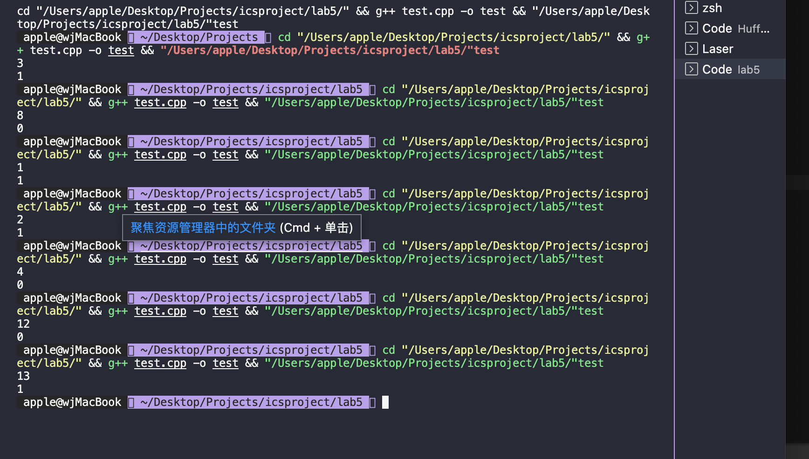
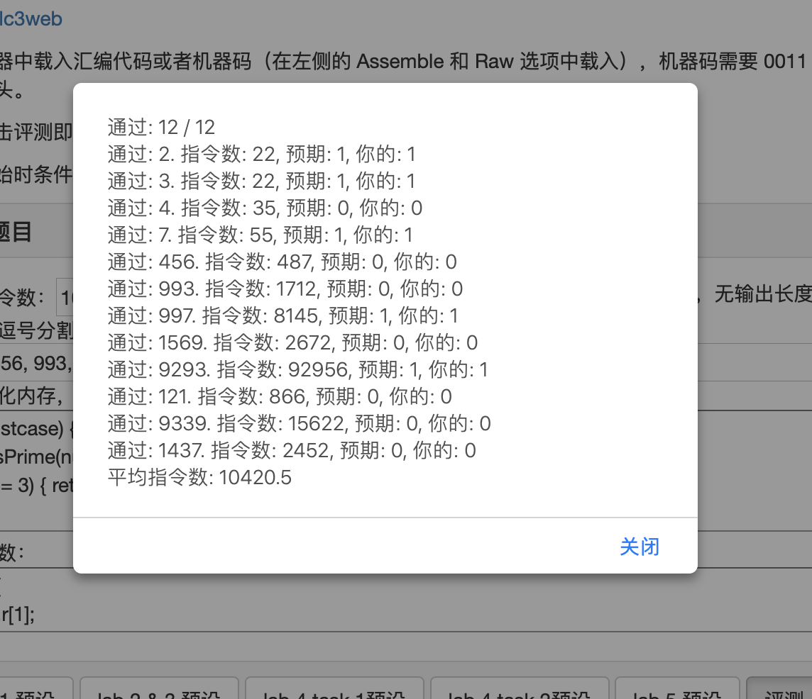
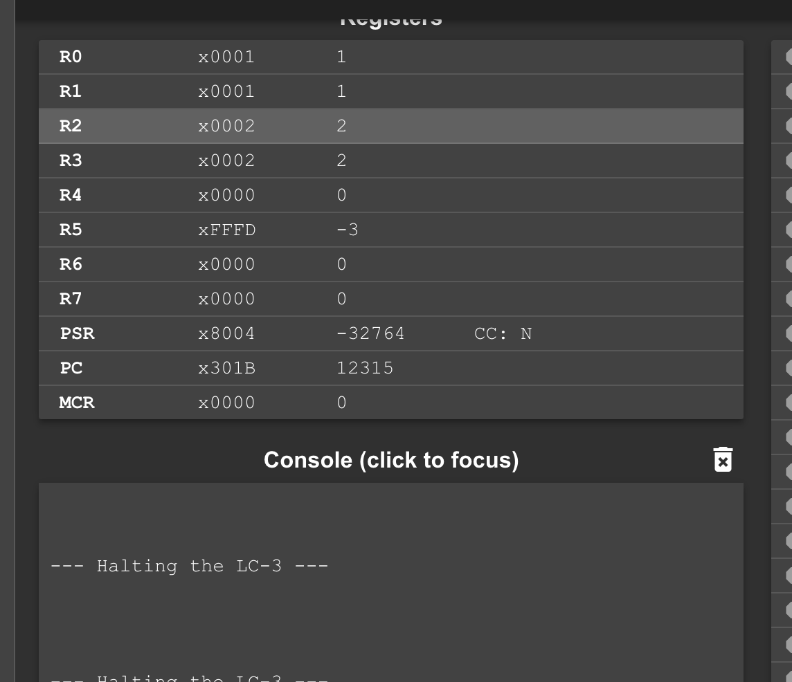
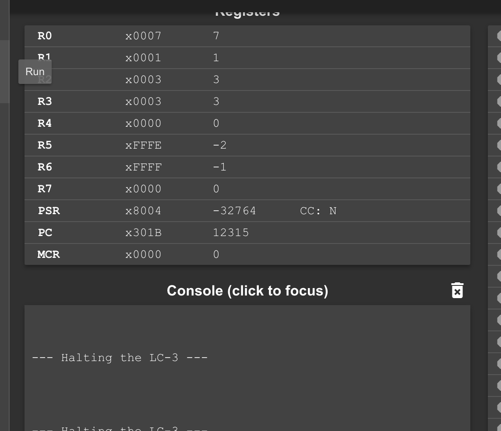
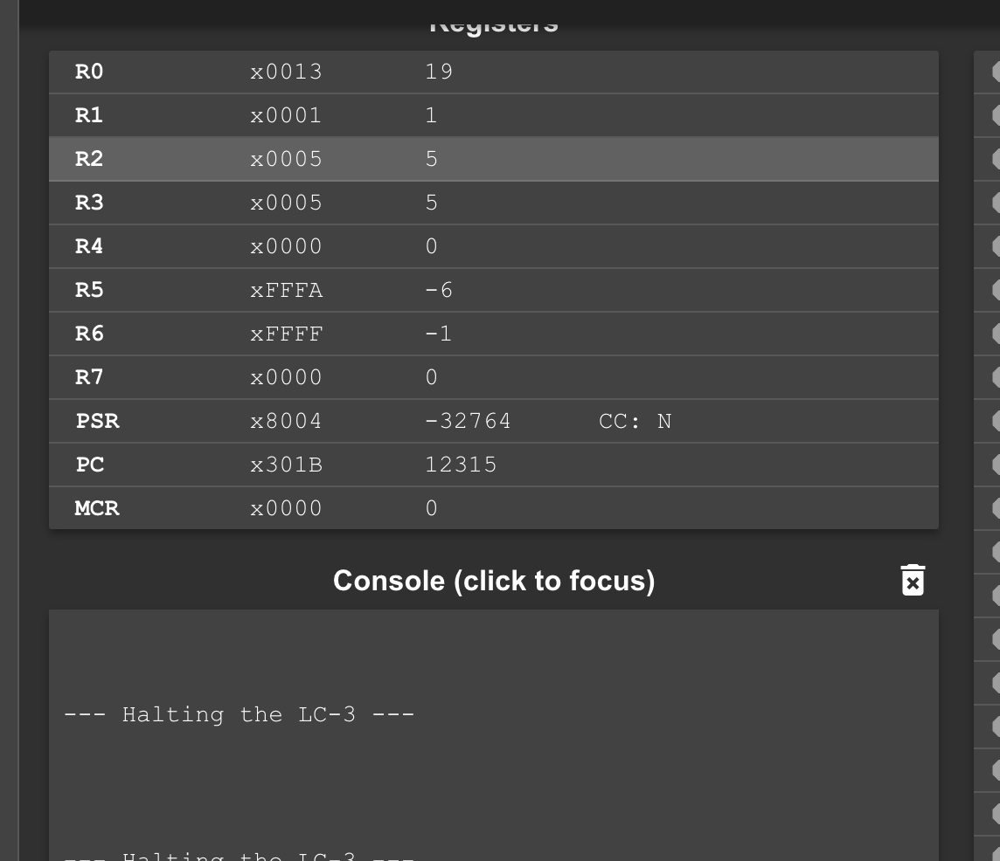
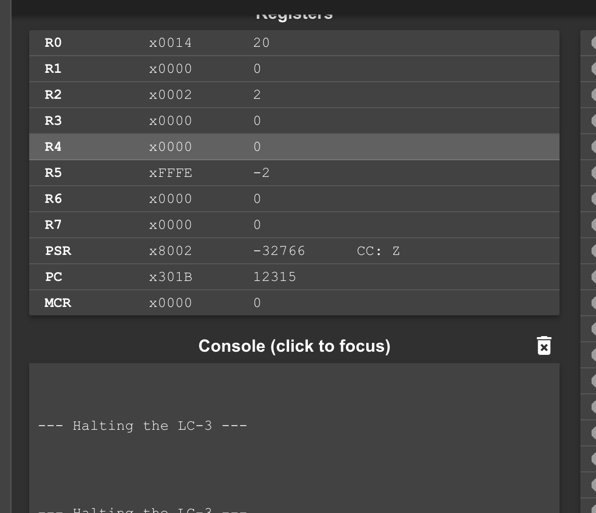
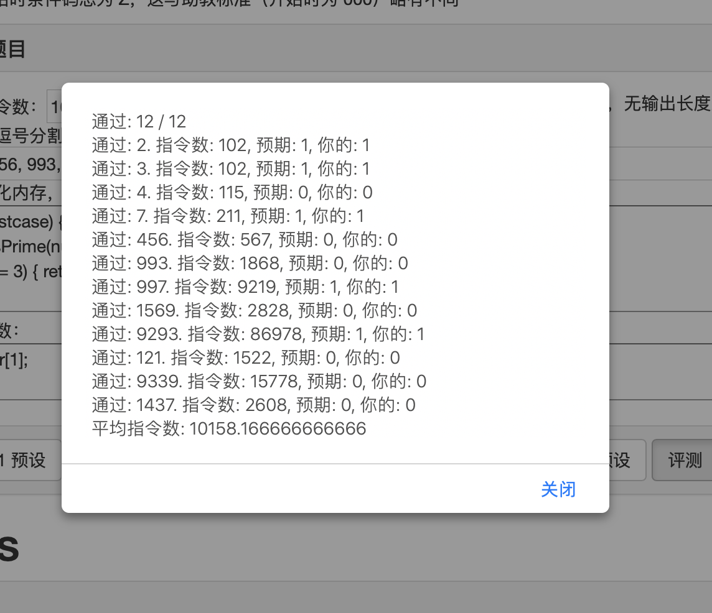
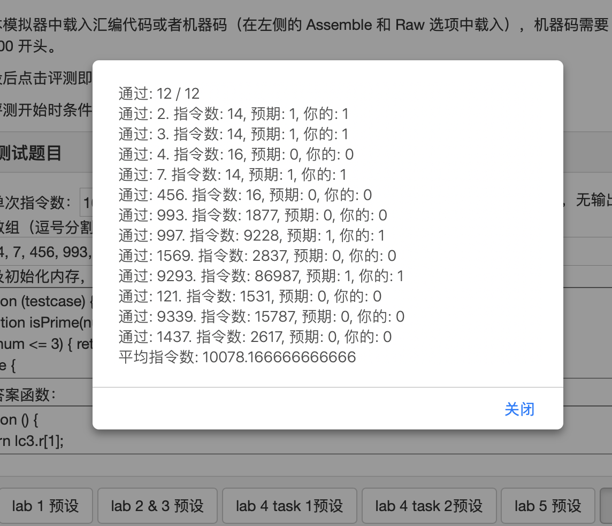

# Lab5实验报告
## 实验要求
本次实验要求我们将一段cpp程序转化为汇编语言，具体cpp程序如下所示：
```cpp
int judge(int r0) {
    int i = 2;
    r1 = 1;
    while (i * i <= r0) {
        if (r0 % i == 0) {
            r1 = 0;
            break;
        }
        i++;
    }
    return r1;
}
```
具体要求的结构如下所示：
```assembly
.ORIG x3000
... ; TO BE DONE
HALT
JUDGE ... ; TO BE DONE
... ; TO BE DONE
RET
... ; TO BE DONE
.END
```
## 实验设计思路
首先，我们采取先观察该段cpp程序的作用的方法，将cpp程序补全如下所示：
```cpp
#include <iostream>

using namespace std;

int judge(int r0) {
    int i = 2;
    int r1 = 1;
    while (i * i <= r0) {
        if (r0 % i == 0) {
            r1 = 0;
            break;
        }
        i++;
    }
    return r1;
}
int main()
{
    int r0,r1;
    cin>>r0;
    r1 = judge(r0);
    cout<<r1<<endl;
}
```
在测试数个样例后结果如下所示：
<center class = "half">
    
</center>
由此我们可以看出，这一程序的目的即为判断一个数是否为素数。若为素数，则R1为1，反之，R1为0。

在得知程序的目的后，就很容易得到相应的代码。我们在程序中调用judge函数，采用JSR指令，同时注意在函数内部要维护R7的值。

为了翻译程序，我们对cpp代码一句一句的分析。对于$i*i$来说，我们运用lab1中的计算乘法的方法即可。判断下列式子时
```cpp
R0 % i == 0
```
我们采用，将R0的值反复减去i，如果为出现为0则正确，如果为正则继续循环相减，如果为负则不正确。

通过这一思路，我们最终得到的代码如下所示：
```assembly
.ORIG	x3000
    AND R1,R1,#0
    AND R2,R2,#0
    AND R7,R7,#0
    JSR JUDGE
    HALT
JUDGE ADD R2,R2,#2
    ADD R1,R1,#1
    AND R4,R4,#0
    AND R3,R3,#0
    ;R2*R2 => R3
star ADD R4,R2,#0
    ADD R3,R2,#0
    AND R5,R5,#0
    ;乘法结果放在R3
mul ADD R5,R5,R3
    ADD R4,R4,#-1
    BRnp mul
    NOT	R5,R5
    ADD R5,R5,#1
    ADD R5,R5,R0
    BRn DONE
    ;if(R0%i == 0) R1 = 0;break;
    ;求R0%i
    ;i存放在R2
    AND R3,R3,#0
    AND R4,R4,#0
    ADD R5,R2,#0
    ADD R6,R0,#0
    NOT R5,R5
    ADD R5,R5,#1
mod ADD R6,R6,R5
    BRp mod
    BRn neg
    AND R1,R1,#0
    BRz DONE
neg ADD R2,R2,#1
    BRnzp star
DONE RET    
.END
```
接下来我们验证该程序的正确性。

首先我们利用LC3的评测网站，测试结果如下所示：
<center class = "half">
    
</center>
测评网站测试了12个数据，均通过。
之后我们再在LC3上进一步验证我们程序的正确性。
下面分别为R0 = 1，R0 = 7，R0 = 19，R0 = 20的结果：
<center class = "half">
    
    
    
    
</center>
综上，该程序的正确性在LC3上得到了验证。

## 实验优化
对于该实验来说，并未要求对指令数的优化，但是对于该程序来说，根据LC3测评网站的数据，平均指令数达到了10000左右，对于一个程序来说指令数较大，应该有较大的优化空间。

我们首先注意到该程序中运用到的乘法，我们可以采取lab1中的p版本，得到程序如下所示：
```assembly
.ORIG	x3000
    AND R1,R1,#0
    AND R2,R2,#0
    AND R7,R7,#0
    JSR JUDGE
    HALT
JUDGE ST R7,save7
    ADD R2,R2,#2
    ADD R1,R1,#1
    AND R4,R4,#0
    AND R3,R3,#0
    ;R2*R2 => R3
star ADD R4,R2,#0
    ADD R3,R2,#0
    AND R5,R5,#0
    ADD R6,R5,#1
    AND R7,R7,#0
    ;乘法结果放在R5
mul AND R5,R3,R6
    BRz Skip
    ADD R7,R7,R4
Skip    ADD R4,R4,R4
    ADD R6,R6,R6
    BRnp mul
    ADD R5,R7,#0
    NOT	R5,R5
    ADD R5,R5,#1
    ADD R5,R5,R0
    BRn DONE
    ;if(R0%i == 0) R1 = 0;break;
    ;求R0%i
    ;i存放在R2
    AND R3,R3,#0
    AND R4,R4,#0
    ADD R5,R2,#0
    ADD R6,R0,#0
    NOT R5,R5
    ADD R5,R5,#1
mod ADD R6,R6,R5
    BRp mod
    BRn neg
    AND R1,R1,#0
    BRz DONE
neg ADD R2,R2,#1
    BRnzp star
DONE LD R7,save7
    RET   

save7 .BLKW	1
.END 
```
在经过这样的优化后，所需的指令数如下所示：
<center class = "half">
    
</center>
我们通过这里可以看出，虽然乘法进行了一定的优化，但是最终所需的指令数的减少并不是非常的可观。

对于这份代码而言，如果想尽可能的减少指令数，可以先预处理一些特殊情况。首先我们知道，在0到8中，除了0以外，其余的奇数都是素数。所以我们可以预处理一些特殊的情况。再者，如果这个数为偶数，对应了它二进制最低位为0，如果这个数并不是0或2，那它一定是素数。

所以由此我们得到的优化代码如下所示：
```assembly
.ORIG	x3000
    AND R1,R1,#0
    AND R2,R2,#0
    AND R7,R7,#0
    JSR JUDGE
    HALT
JUDGE ST R7,save7
    ADD R1,R1,#1
    ADD R0,R0,#0
    BRz DONE
    AND R4,R0,#1
    BRz ou
    ADD R4,R0,#-9
    BRn DONE
    BRzp keep
ou  ADD R4,R0,#-2
    BRz DONE
    AND R1,R1,#0
    BRnzp DONE
keep AND R1,R1,#0
    ADD R2,R2,#2
    ADD R1,R1,#1
    AND R4,R4,#0
    AND R3,R3,#0
    ;R2*R2 => R3
star ADD R4,R2,#0
    ADD R3,R2,#0
    AND R5,R5,#0
    ADD R6,R5,#1
    AND R7,R7,#0
    ;乘法结果放在R5
mul AND R5,R3,R6
    BRz Skip
    ADD R7,R7,R4
Skip    ADD R4,R4,R4
    ADD R6,R6,R6
    BRnp mul
    ADD R5,R7,#0
    NOT	R5,R5
    ADD R5,R5,#1
    ADD R5,R5,R0
    BRn DONE
    ;if(R0%i == 0) R1 = 0;break;
    ;求R0%i
    ;i存放在R2
    AND R3,R3,#0
    AND R4,R4,#0
    ADD R5,R2,#0
    ADD R6,R0,#0
    NOT R5,R5
    ADD R5,R5,#1
mod ADD R6,R6,R5
    BRp mod
    BRn neg
    AND R1,R1,#0
    BRz DONE
neg ADD R2,R2,#1
    BRnzp star
DONE LD R7,save7
    RET   

save7 .BLKW	#1
.END
```
该部分代码优化出的指令数结果如下图所示：
<center class = "half">
    
</center>

## 实验总结
本次实验主要是在功能上翻译一段cpp的代码。代码的实现比较简单，但是对于如何将该代码的指令数尽可能的减少比较麻烦。在判断偶数时已经优化到了非常理想的地步，而在判断奇数时，对于较小的数或者较大的非素数时，算法效率较为客观，但是对于较大的素数时，该算法的效率略微有一点低，经过分析主要原因可能是在于求平方时用的指令数过多，即使使用移位的快速幂算法时优化的程度仍然不是很好。