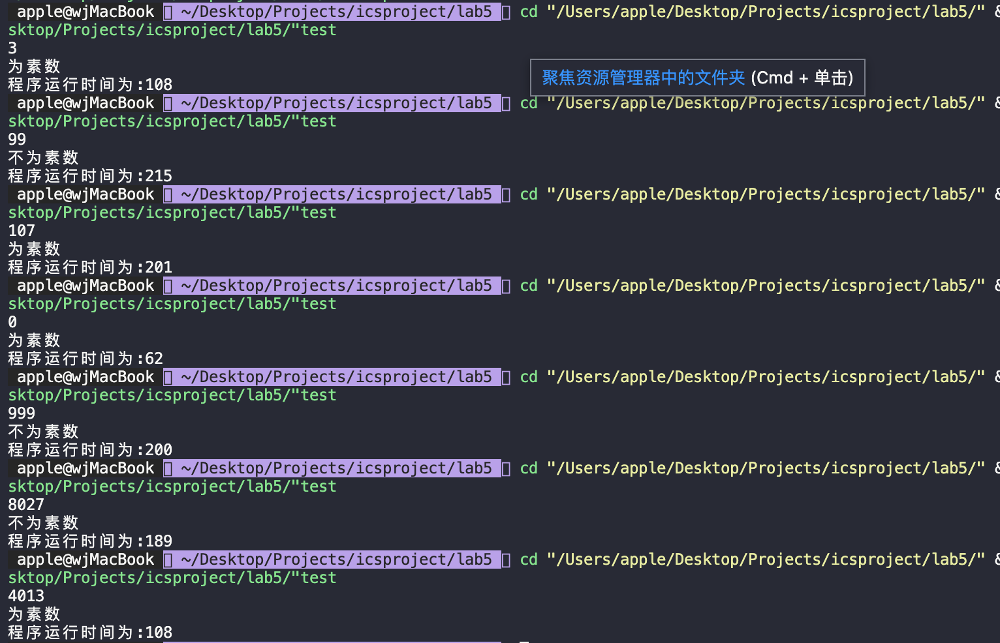

# Lab6实验报告
## 实验要求
本次实验首先要求我们用高级语言实现对之前几次实验的代码复现，并展开相关思考。
## 代码复现
### lab1
首先是lab1的代码。在本次实验中，我们选择用c语言复现代码，并且用c库函数clock( )来计算程序运行所需要的时间。下面分别为l版本和p版本的代码：
```c
#include <stdio.h>
#include <time.h>

int main()
{
    clock_t start_time,end_time;
    start_time = clock();
    short r0,r1,r7;
    scanf("%hd%hd",&r0,&r1);
    do
    {
        r7 = r7+r0;
        r1--;
    }while(r1 != 0);
    printf("算法的结果为:%hd\n",r7);
    end_time = clock();
    printf("运行总时间为:%lf",(double)(end_time-start_time));
}
```
```c
#include <stdio.h>
#include <time.h>
int main()
{
    clock_t start_time,end_time;
    start_time = clock();
    short ans,a,b;
    short cnt = 1;
    ans = 0;
    scanf("%hd%hd",&a,&b);
    while(cnt)
    {
        if(b & cnt) 
        {
            ans = ans+a;
        }
        cnt = cnt<<1;
        a = a+a;
    }
    printf("答案为:%hd\n",ans);
    end_time = clock();
    printf("所需的总时间为:%lf",(double)(end_time-start_time));
}
```
这里将寄存器和内存等概念抽象掉，利用高级语言还原了基本的算法结构，同时利用clock( )计算程序所需的总时间。

下面是l版本运行结果的测试：
<center class = "half">
    
</center>
运行结果符合预期。

下面是p版本的运行结果:
<cneter class = "half">
    
</center>
运行结果符合预期。

从上面我们可以看到，快速幂算法，即p版本所用的时间平均下来要小于l版本所用的时间，但优化程度并没有像LC3中指令数优化的结果程度那么大，这是由于高级语言的特性所导致的。对于越大的两数相乘，时间优化的就越明显。

对于l版本来说，它的时间复杂度为O(n)，空间复杂度为O(1)，对于p版本来说，它的时间复杂度为O(1)，空间复杂度为O(1)。
### lab2
该实验实现了一个类斐波那契数列求和的算法，根据原算法用c语言实现的代码如下所示：
```c
#include <stdio.h>
#include <time.h>
int F(int n)
{
    if((n--) == 0) return 1;
    else if((n--) == 0) return 1;
    else if((n--) == 0) return 2;
    else 
    {
        int a = 1;
        int b = 1;
        int c = 2;
        int d;
        while(n >= 0)
        {
            d = (c+2*a)%1024;
            a = b;
            b = c;
            c = d;
            n--;
        }
        return d;
    }
}
int main()
{
    int n;
    clock_t start_time,end_time;
    start_time = clock();
    scanf("%d",&n);
    printf("F(n) = %d\n",F(n));
    end_time = clock();
    printf("该程序运行时间为:%lf",(double)(end_time-start_time));
}
```
这个算法主要运用了将递归转化为非递归求解的思路，下面是其运行的结果
<center class = "half">
    
</center>
运行结果符合预期，且我们可以看到当输入的n过大的时候程序运行所需的时间也在增加。

对于该算法的实现来说，它的时间复杂度为O(n)，空间复杂度为O(1)。
### lab3
该实验是采用循环打表的方法来优化程序的执行时间，在这里我们首先将表赋值给数组，然后再根据n的大小来确定F(n)的位置。具体代码如下所示：
```c
#include <stdio.h>
#include <time.h>
int F(int n)
{
    if((n--) == 0) return 1;
    else if((n--) == 0) return 1;
    else if((n--) == 0) return 2;
    else 
    {
        int a = 1;
        int b = 1;
        int c = 2;
        int d;
        while(n >= 0)
        {
            d = (c+2*a)%1024;
            a = b;
            b = c;
            c = d;
            n--;
        }
        return d;
    }
}
int main()
{
    clock_t start_time,end_time;
    start_time = clock();
    int n;
    int ans;
    int a[148] = {1,1,2,4,6,10,18,30,50,86,146,246,418,710,178,1014,386,742,722,470,930,326,242,54,706,166,274,662,994,518,818,758,770,358,850,342,34,710,370,438,834,550,402,22,98,902,946,118,898,742,978,726,162,70,498,822,962,934,530,406,226,262,50,502,2,102,82,86,290,454,626,182,66,294,658,790,354,646,178,886,130,486,210,470,418,838,754,566,194,678,786,150,482,6,306,246,258,870,338,854,546,198,882,950,322,38,914,534,610,390,434,630,386,230,466,214,674,582,1010,310,450,422,18,918,738,774,562,1014,514,614,594,598,802,966,114,694,578,806,146,278,866,134,690,374,642,998,722,982};
    scanf("%d",&n);
    if(n < 20) ans = a[n];
    else
    {
        if(n >= 20)
        {
            n = n-20;
            n = n % 128;
            ans = a[20+n];
        }
    }
    printf("答案为%d\n",ans);
    end_time = clock();
    printf("程序所需时间为:%lf",(double)(end_time-start_time));
}
```
该段程序中的赋值语句是由c语言生成的，代码如下所示：
```c
#include <stdio.h>
int F(int n)
{
    if((n--) == 0) return 1;
    else if((n--) == 0) return 1;
    else if((n--) == 0) return 2;
    else 
    {
        int a = 1;
        int b = 1;
        int c = 2;
        int d;
        while(n >= 0)
        {
            d = (c+2*a)%1024;
            a = b;
            b = c;
            c = d;
            n--;
        }
        return d;
    }
}
int main()
{
    for(int n = 0;n < 148;n++)
    {
        printf("%d,",F(n));
    }
    return 0;
}
```
这样我们就得到了循环打表程序的c语言表示。下面为该程序的测试结果：
<center class = "half">
    
</center>
从上述结果中我们可以看到，经过打表的优化之后，大数据的计算时间大幅度减小，整体程序所需的时间减少，优化程度十分可观。

而对于该算法来说，其时间复杂度为O(1)，空间复杂度为O(1)。

### lab4
lab4的要求是翻译两端程序，在这里我们就根据机器码的含义，一句一句的翻译得到程序如下所示：
```c
#include <stdio.h>
#include <time.h>
int main()
{
    short r[8];
    short mem[11] = {0,0,0,0,0,0,0,0,0,0,5};
    clock_t start_time,end_time;
    start_time = clock();
    for(int i = 0;i < 8;i++)
    {
        r[i] = 0;
    }
    r[2] = 0x300f;
    r[0] = r[0]+0;
    r[7] = 0x3003;

    while(1)
    {
        mem[r[2]-0x300f] = r[7];
        r[2] = r[2]+1;
        r[0] = r[0]+1;
        r[1] = mem[0x3019-0x300f];
        r[1] = r[1]-1;
        mem[0x3019-0x300f] = r[1];
        if(r[1] == 0) break;
        r[7] = 0x300c;
    };

    while(1)
    {
        r[2] = r[2]-1;
        r[7] = mem[r[2]-0x300f];
        if(r[7] != 0x3003) continue;
        else
        {
            printf("寄存器的值分别为:\n");
            printf("r0 = %#x,",r[0]);
            printf("r1 = %#x,",r[1]);
            printf("r2 = %#x,",r[2]);
            printf("r3 = %#x,\n",r[3]);
            printf("r4 = %#x",,r[4]);
            printf("r5 = %#x,",r[5]);
            printf("r6 = %#x,",r[6]);
            printf("r7 = %#x\n",r[7]);
            break;
        }
    }
    end_time = clock();
    printf("程序总共用时:%lf\n",(double)(end_time-start_time));
}
```
下面为程序的输出情况：
<center class = "half">
    
</center>
结果符合预期。

下面是第二段程序：
```c
#include <stdio.h>
#include <time.h>
#include<stdio.h>
int main()
{
    //求内存中某个值除以七的余数，该内存的值被放在了r1中
    short r0,r1,r2,r3,r4,r5,r6,r7;
    short memory;
    clock_t start_time,end_time;
    start_time = clock();
    printf("输入内存中的数:");
    scanf("%hd",&memory);
    r1 = memory;
    r7 = 0x3002;
    while(1){
        r2 = r2 & 0;
        r3 = r3 & 0;
        r4 = r4 & 0;
        r2 = r2+1;
        r3 = r3+8;
        do{
            r5 = r1 & r3;
            if(r5 != 0){
                r4 = r4+r2;
            }
            r2 = r2+r2;
            r3 = r3+r3;
        }while(r3 != 0);
        r2 = r1&7;
        r1 = r2+r4;
        r0 = r1-7;
        if(r0 > 0){
            continue;
        }
        r0 = r1-7;
        if(r0 == 0){
            r1 = r1-7;
        }
        printf("r1 = %hd\n",r1);
        end_time = clock();
        printf("程序所用的总时间:%lf",(double)(end_time-start_time));
        return 0;
    }
}
```
这一段程序实现了r1将内存中的某个值读出来，并求其除以七的余数，代码运行结果如下所示：
<center class = "half">
    
</center>
运行结果符合预期，并且程序的执行效率较高。

### lab5
下面为lab5的算法，由于助教提前给了算法让我们翻译，故这里给的代码的基本思路和助教的基本一致，代码如下所示：
```c
#include <stdio.h>
#include <time.h>
short fastmul(short i)
{
    short cnt = 1;
    short ans = 0;
    short temp = i;
    while(cnt)
    {
        if(temp & cnt) 
        {
            ans = ans+i;
        }
        cnt = cnt<<1;
        i = i+i;
    }
    return ans;
}
short judge(short r0)
{
    short i = 2;
    short r1 = 1;
    if(r0 == 0||r0 == 2) return 1;
    if((r0 & 1) == 0) return 0;
    while(fastmul(i) <= r0)
    {
        if(r0 % i == 0)
        {
            r1 = 0;
            break;
        }
        i++;
    }
    return r1;
}
int main()
{
    clock_t start_time,end_time;
    start_time = clock();
    short r0;
    scanf("%hd",&r0);
    if(judge(r0))
    {
        printf("为素数\n");
    }
    else
    {
        printf("不为素数\n");
    }
    end_time = clock();
    printf("程序运行时间为:%lf",(double)(end_time-start_time));
    return 0;
}
```
运行结果如下所示：
<center class = "half">
    
</center>
代码结果符合预期，并且实现的效率较高，在这里我们用cpp程序再进行测试一遍，所用cpp程序如下所示：

```cpp
#include <iostream>

using namespace std;

int judge(int r0) {
    int i = 2;
    int r1 = 1;
    while (i * i <= r0) {
        if (r0 % i == 0) {
            r1 = 0;
            break;
        }
        i++;
    }
    return r1;
}
int main()
{
    int r0,r1;
    cin>>r0;
    r1 = judge(r0);
    cout<<r1<<endl;
}
```
程序运行结果如下所示：
<center class = "half">
    
</center>
由上可知在没有进行优化的情况下，大数据的时候cpp的程序运行速度并没有c程序快，当然这种差距在本问题下并不是十分明显，几乎可以忽略不计。而在更大的偶数的判断情况下，如果没有预先判断偶数的优化，其运行时间会相差非常大，下面是没有进行优化的：
<center class = "half">
    
</center>
而经过优化的程序运行时间会有非常大的区别：
<center class = "half">
    
</center>
这里就体现了在不改变算法的情况下，对一些特殊情况进行优化可以在很大程度上提升程序的运行效率。

在这里我们的程序时间复杂度是O($n^2$),空间复杂度为O(1)。

## 实验心得
本学期该门课程的主要内容是学习LC3这一工具。编程方面学习了Lc3的机器码和汇编语言。这两种语言解决问题的思路和效率和我们之前学的高级语言有着很大的区别，
在这里我们先回答几个问题。
### how to evaluate the performance of your own high-level language programs
在这里我们运用clock( )函数来衡量我们程序处理问题的耗时，对于简单的问题，我们可以估算出程序的时空复杂度来衡量程序的性能。
### why is a high-level language easier to write than LC3 assembly
虽然使用高级语言的同时，失去了一些对硬件的控制，但是高级语言的设计有一部分原因就是为了方便人们编程，将一些任务交给机器自己去管理，而不是像汇编一类语言一样在任何事上都要亲力亲为，例如所有的高级语言都会由机器自己去帮你管理寄存器，而汇编不可以，只能由你自行管理，在这个过程中就会消耗大量的时间去协调各个寄存器，以及解决寄存器不够的问题。对于一些简单功能的实现高级语言已经提供了大量好用的库函数。避免了反复造轮子的过程，而低级语言不支持这样的做法。

另一个原因就是debug的原因，高级语言debug的效率要远远高于低级语言，原因之一是高级语言有许多功能强大的debug工具，并且这些工具往往都会集成在ide中，而汇编语言所拥有的debug工具几乎没有，只能靠开发者自己去消耗大量的时间完成低效率的工作。

再者，高级语言的设计之初，就考虑了语言的阅读友好性，关键词的意思基本上与英文保持一致，这就给阅读带来了极大的方便。而对于机器码来说，01串的阅读效率非常低，往往大量的精力都会耗费在阅读代码上，更不用说对代码进行维护等操作了。而高级语言的可阅读性，就让编程人员将精力更加的集中在问题的解决上，而不是深究电脑究竟怎么工作的。

### what instructions do you think need to be added to LC3? (You can think about the previous experiments and what instructions could be added to greatly simplify the previous programming)
我认为LC3应该添加一个右移指令，之前在做快速幂运算的时候，如果能用到右移指令的话，指令数会少很多。并且在做除法，求余等运算的时候，也可以用到右移的指令。并且这个指令与左移不同的是，若用现有的指令将其实现，难度较大，故添加一个右移指令比较好。
### is there anything you need to learn from LC3 for the high-level language you use?
在编写LC3程序的时候，会十分注意内存的管理和程序的优化，而在使用高级语言时，我往往不会那么注意时间空间的开销，而是将问题解决就了事了。低级语言对于内存的管理对与c与cpp的学习有着非常的借鉴作用，例如自己开了那一块内存空间，怎么控制非法访问与越界的情况，这些都是可以移植到c与cpp程序的学习上来的。

编写软件的过程中要兼具硬件的思维，这是我这门课学到的一个非常重要的认识，这学期的LC3的学习和另外一门数字电路实验的学习让我充分意识到了这一点。虽然说我们在编写高级语言程序的时候往往忽略与抽象了硬件层面，但是通过汇编语言的学习与LC3的使用，让我意识到要想充分优化一段代码，硬件的思维与知识是必不可少的，这是以后学习的一个基础。

另外针对LC3的几次实验让我充分意识到了优化程序的重要性，以及如何优雅的编写一段程序。时间与空间的开销都应该时刻被考虑进来。而对于laba与labs的实验，让我感受到了如何使用高级语言来模拟一个冯诺伊曼结构的机器。这对于整个课程体系的认知有着极大的帮助。

## 总结与思考
本学期的实验到这里就全部完成了，个人感觉本学期的实验相对于其他课程来说非常的不同，更倾向于在编程中玩，体会编程中的乐趣。每一次实验与其他的课程不同的是，其他课程更倾向于完成实验，而这门课更倾向于做好一个实验，将实验优化到极致，在这门课程中我也学到了许多课程内学不到的知识，大实验中的cpp知识和代码框架都对自己的编程能力有着极大的提升。